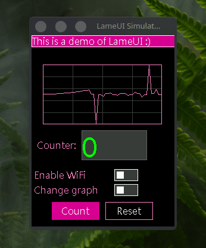

## LameUI - a lame & lightweight non-buffered UI library for embedded systems

This is a useless readme, I'll make a proper once later.

## What?
LameUI is a super simple, platform independent UI library with lots and lots of limitations, designed for embedded systems with low resources. Though its under active development and I'm trying to remove those limitations. For now it supports only three UI elements. Completely unsuitable for any kind of application.

## Why?
Main reason - to challenge my skills and learn new things. I also happened to need a bare-minimum UI library for my own project which I abandoned as I started to make this one instead. It was started as a lockdown project and soon enough I abandoned it in an incomplete state as I lost interest. After 4 months I came back to it with a goal to at least make it work once. Future of this project is uncertain, but as long as it feels challenging, I'll keep adding/fixing stuffs.

## Lame Demo:
This is a demo of LameUI running on a simulator I made with opengl so I can test it without needing to flash the microcontroller every time.

simulator: https://github.com/abhra0897/LameUI_simulation



The UI library is not primarily designed to work with OpenGL. So, rendering is slow in the simulator. The gif recorder made it look even slower, hah!

## UI Elements
Following UI elements are implemented so far:
- Button
- Switch
- Line chart
- Label
- Panel
Next step is adding a slider and checkbox

## Display Output
Drawing to display is done by call back functions provided by the user.

```C
void lui_dispdrv_set_draw_pixels_area_cb(void (*draw_pixels_area_cb)(uint16_t x, uint16_t y, uint16_t w, uint16_t h, uint16_t color), lui_dispdrv_t *dispdrv);
```

LameUI is a non-buffered UI library, i.e., it has no buffer of its own. Because it's mainly targetted towards MCUs with low RAM. As a result, user need to manage buffering if they need to. Sometimes buffering, and then flush the entire buffer is faster than writing individual pixels each time. I'll add a "flush_ready" flag soon, so, if user wants to do buffering, they'll know when to flush the buffer.

## Read Inputs
LameUI natively supports two different types of input devices - touch input, D-pad input. Inputs are read using callback functions supplied by the user.

```C
1. void lui_touch_inputdev_set_read_input_cb(void (*read_touch_input_cb)(tLuiTouchInputData *inputdata), tLuiTouchInputDev *inputdev);
2. void lui_dpad_inputdev_set_read_input_cb(void (*read_dpad_input_cb)(tLuiDpadInputData *dpad_inputdata), tLuiDpadInputDev *dpad_inputdev);
```

## Structure of LameUI
TBD

## Simple Example
TBD
(for now, go to the Simulator repo and see the example there: https://github.com/abhra0897/LameUI_simulation/blob/experimental/src/main.c)

## API
Documentation is not prepared yet cause each day I'm changing the code. Also, probably no one else will use it. For now, read the header file for all the available functions.
